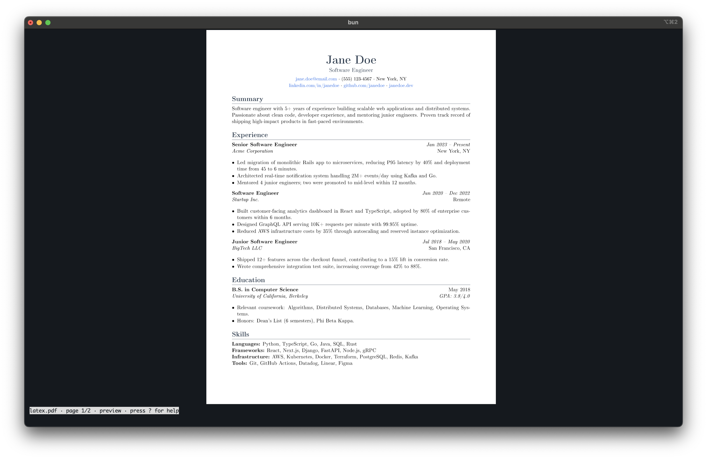
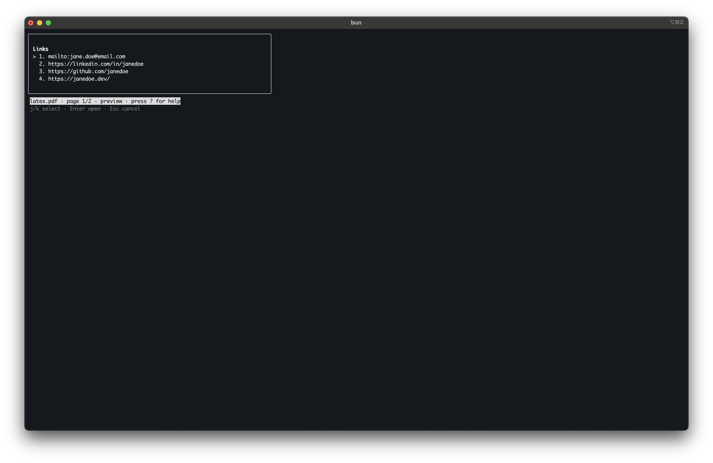

# foliotty

> Read PDF documents in your terminal. Works locally and over SSH — useful for reviewing resumes, papers, and reports on a remote machine without copying files back.



Press `l` to list every hyperlink on the current page, then `Enter` on the one you want to crosscheck — it opens in your browser without leaving the terminal.



## Quick start

```sh
npx foliotty path/to/document.pdf
```

That's it. No global install required, no browser. The first run downloads the package and an optional native dependency (`@napi-rs/canvas`) so the high-fidelity inline preview can render.

If you'd rather install once:

```sh
npm install -g foliotty
foliotty path/to/document.pdf
```

## Keys

| Key       | Action                                               |
| --------- | ---------------------------------------------------- |
| `j` / `k` | previous / next line in text mode                    |
| `J` / `K` | previous / next page                                 |
| `p`       | go to page                                           |
| `t`       | toggle preview / text mode                           |
| `/`       | search                                               |
| `n` / `N` | next / previous match                                |
| `l`       | show links on current page                           |
| `Enter`   | submit a prompt or open the selected link            |
| `Esc`     | cancel a prompt — or quit if you're at the top level |
| `?`       | toggle help                                          |

## Modes

- **Preview** (default when supported): rasterizes each page to a PNG and emits it inline using iTerm2's OSC 1337 or Kitty's APC `_G` graphics protocol. Highest fidelity.
- **Text**: extracts the PDF text layer and reflows it with preserved structure (headings, bold/italic, bullets, hyperlinks). Lower fidelity but works in any terminal.

`t` toggles between them. The status row at the bottom always tells you which mode you're in.

## Requirements

- **Node.js 22 or newer.**
- **Inline preview:** iTerm2 or Kitty as your local terminal. Other terminals fall back to text mode.
- **Native canvas:** `@napi-rs/canvas` ships prebuilt binaries for `linux-x64-gnu`, `linux-arm64-gnu`, `darwin-x64`, `darwin-arm64`, and `win32-x64-msvc`. Alpine / musl Linux falls back to text mode (the optional dependency fails silently and the rest of the app keeps working).

## Over SSH

Inline images travel through SSH like any other bytes, but `foliotty` decides preview vs text from environment variables on the _remote_ shell. By default OpenSSH does not forward `TERM_PROGRAM`, so the remote ends up in text mode even when your local terminal supports inline images.

Pick whichever is easier:

```sh
# one-shot: force the protocol your local terminal speaks
FOLIOTTY_GRAPHICS=iterm foliotty path/to/document.pdf
FOLIOTTY_GRAPHICS=kitty foliotty path/to/document.pdf
```

Or forward the env var permanently — on the client (`~/.ssh/config`):

```
Host my-vm
    SendEnv TERM_PROGRAM
```

And on the server (`/etc/ssh/sshd_config`, then reload sshd):

```
AcceptEnv TERM_PROGRAM
```

## Limitations

- Scanned / image-only PDFs (no text layer) are unsupported; the CLI exits with a clear error.
- Column reflow in text mode is best-effort. Two-column academic papers may interleave columns in the reflowed text.
- Search hit ordering follows pdfjs content-stream order, which isn't always strict top-to-bottom — a footnote can rank before the body it footnotes.
- Sixel terminals are detected but not yet drawn to (text mode for now).

## Contributing

```sh
git clone https://github.com/mfarhan0304/foliotty.git
cd foliotty
bun install
bun run dev path/to/document.pdf
```

Guidelines:
Issues and PRs welcome.

## Acknowledgments

- [`pdfjs-dist`](https://github.com/mozilla/pdf.js) (Apache-2.0) — PDF parsing, text extraction, and page rasterization.
- [`ink`](https://github.com/vadimdemedes/ink) (MIT) — React renderer for the terminal UI.
- [`@napi-rs/canvas`](https://github.com/Brooooooklyn/canvas) (MIT) — prebuilt Canvas backend that pdfjs renders into.
- iTerm2's [OSC 1337 inline image protocol](https://iterm2.com/documentation-images.html) and Kitty's [terminal graphics protocol](https://sw.kovidgoyal.net/kitty/graphics-protocol/).

## License

Apache-2.0. See [LICENSE](LICENSE) for the full text.
